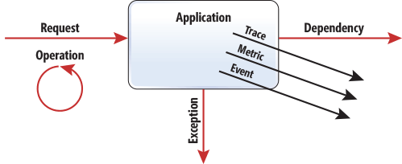

# Application Insight Sampling

This repository demonstrates some techniques to leverage AI sampling to produce telemetry that are
reduced to make them actionable.

## Telemetry data model
The Application Insights SDK offers the model that enables the Application Insights Service to render effective and intuitive UI to support your monitoring, troubleshooting and analytical needs

Application Insights SDK defines three telemetry types: request, exception and dependency



For every one of these types, Telemetry Data Model defines fields used to construct common KPIs–name, duration, status code and correlation. It also lets you extend every type with the custom properties. Here are some typical fields for each of the event types:

- Request (operation id, name, URL, duration, status code, […])
- Dependencies (parent operation id, name, duration, […])
- Exception (parent operation id, exception class, call stack, […])

Typically, these types are defined by the application framework and are automatically collected by the SDK. For example, ASP.NET MVC defines the notion of a request execution in its model-­view-controller plumbing–it defines when request starts and stops, dependency calls to SQL are defined by System.Data, and calls to HTTP endpoints are defined by System.Net. However, there are cases where you might need to expose telemetry unique to your application. For example, you might want to implement diagnostics logging using a familiar-to-you instrumentation framework, such as Log4Net or System.Diagnostics, or you might want to capture user interaction with your service to analyze usage patterns. Application Insights recognizes three additional data types to assist with such a need—Trace, Event and Metric:

- Trace (operation id, message, severity, […])
- Metrics (operation id, name, value, […])
- Event (operation id, name, user id, […])

### Reduction Techniques
There are four data reduction techniques available in the Application Insights SDK. As a developer, you might utilize them using a built-in extensibility API. We’ll demonstrate usage of those APIs later in this article.

#### Metrics extraction and aggregation 
is a technique that lets you locally reduce data by aggregating metrics from telemetry data and sending only aggregated values, instead of the events themselves. Imagine you have 100 requests per minute. If the only thing you care about is the number of requests per minute, this technique would let you locally count the number of requests and send the value once a minute, instead of sending each request and calculating counts from the raw telemetry.

#### Sampling 
Is a technique that selectively collects subsets of telemetry that lets you estimate the characteristics of the service. For most services you might collect every “n-th” request to get well-distributed statistical representation of service behavior. This technique, on the one hand, lets you reduce the volume of collection by “n” times, and on the other hand, preserves with certain accuracy statistical validity of the metrics derived from such telemetry. For better accuracy, a sophisticated algorithm and data model must be used.

#### Exemplification 
Is the ability to collect samples of interest without invalidating sampling statistical accuracy. For example, you might want to always collect request failures regardless of sampling configuration. This way, while you reduce telemetry load with sampling, you can preserve useful troubleshooting data.

#### Filtering 
Is the ability to reduce data by filtering out telemetry you don’t care about. For example, you might want to ignore all telemetry related to traffic generated by synthetic monitoring or search bots. This way, your metrics will reflect true user interaction with the service.

### Application Insights SDK
In order to demonstrate these reduction techniques, it’s important to understand how the Application Insights SDK processes telemetry. It can be logically grouped into four stages, as shown in Figure 2.

How the Application Insights SDK Processes Telemetry
Figure 2 How the Application Insights SDK Processes Telemetry


**Data collection is implemented** as a set of telemetry modules, each responsible for particular data sets. For example, there’s a telemetry module to collect dependency, exceptions, performance counters and so on.

**During telemetry enrichment**, each item is augmented with useful telemetry. For example, the Application Insights SDK will automatically add the server name as one of the properties for each telemetry item. There are sets of predefined telemetry initializers; however, developers can add any number of additional initializers to include properties that help with monitoring, troubleshooting and analytical processes. For example, for geo-distributed services, you might want to add geolocation to analyze traffic processed by each datacenter separately. Essentially, during this step you increase the payload of the telemetry items.

**The telemetry processing pipeline** is the place where you define logic for reducing the amount of telemetry sent to the service. The Application Insights SDK provides sampling telemetry processors to automatically reduce collected telemetry data without compromising statistical accuracy.

**Telemetry transmission** is a final step of the telemetry processing where all telemetry data processed by an application is queued, batched, zipped, and periodically sent to one or more destinations. The Application Insights SDK supports transmission to the Application Insights Service and other channels, such as Event Hub, out of the box.


### Metrics Aggregation
Before going further, we want to discuss telemetry type concepts. Generally speaking, you can split all telemetry into two buckets—***metrics*** and ***events***.

A **metric** is defined as a time-series data, pre-aggregated over specified intervals. For example, say you want to count the number of invocations of a function. This is a simple metric that gets incremented each time when call to function occurs. The value of the metrics itself gets aggregated over a period of time—for example, one minute—and at the end of that time is sent out.

An **event** is a single record of an occurrence that’s sent out every time. In many cases, events have very specific structure or type. In the example of Application Insights, the domain model event of a type Request has different properties than event of a type Exception. Going back to the previous example, in case you want to capture every function execution, you might send event with function name and function parameters every time it gets executed. These events let you answer all sorts of questions about function execution. For example, with raw event telemetry, you can calculate how many times this function has been called with a particular parameter value. Notice that with more data fidelity in addition to simple analysis, such as count of function execution, you can now analyze count of execution grouped by function parameter. 

While raw telemetry is much richer and lets you provide better insights, there’s a drawback related to the processing and storage costs associated with that. One way to address this is to create as many metrics up front as you think you’ll need to analyze your application. The problem with this approach is that your business is far more dynamic and it’s not always possible to know what metrics you might need in advance. The Application Insights SDK addresses this issue by providing a balance between aggregated and raw telemetry—it aggregates key application performance indicators and sends sampled raw application telemetry. This sampling approach lets the SDK minimize the overhead of raw data collection and increases the ROI of the collected data.

### Sampling
There are two out-of-the-box sampling telemetry processors provided by the Application Insights SDK—fixed sampling and adaptive sampling.

Fixed-rate sampling reduces the volume of per-node telemetry. For example, you might want to collect only 20 percent of all tele­metry from each node.

Adaptive sampling automatically adjusts the volume of per-node telemetry. For example, you might want to decrease collection when the load is greater than 5 eps/node.

## How Samping algorithm work?

Both sampling telemetry processors use a common algorithm that lets you mix and match those processors 
without affecting statistical accuracy of the data. In order to decide if the telemetry 
item has to be sampled in or out, the SDK uses a stateless hash function and compares 
returned value with configuration ratio. It means that regardless of which thread, process or server 
processes the data, telemetry with a hash value below threshold will be consistently sampled in. 
In simplified form you can codify this algorithm like this:

```
If exist(UserID): Hash(UserID) = (returns value [0..100])
ElseIf exist(OperationID): Hash(OperationID) (returns value [0..100])
Else: Random [0..100]
```

As you can see from here, as long as UserID or OperationID is shared among all related 
telemetry items, it all will have the same hash value and consistently be sampled in or out. 
Application Insights by default enables adaptive sampling when collecting data. 
All telemetry stored in the services has a column called itemCount. It represents the 
sampling ratio at the moment of data collection. Because the hash calculation algorithm is 
stateless, this number doesn’t represent the actual number of sampled out telemetry, it only 
tells the statistical ratio of telemetry sampled in. To quickly analyze if your telemetry 
has been sampled, you can execute the following analytical query to compare the 
number of records stored with the number of records processed by the service:

```
requests | summarize sum(itemCount),
     count()

```

If you see the difference between those two numbers, then sampling has been enabled and your 
data set has been reduced.


### Code
Check out the repo to see how you can write your own telemetry processor to create metrics aggregations and sampling techniques to suit your telemetry needs.

### Closing up

This repo is for demo purpose only- please do not use it in production as-it.

Thanks